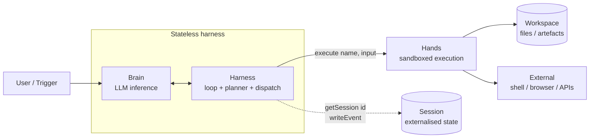
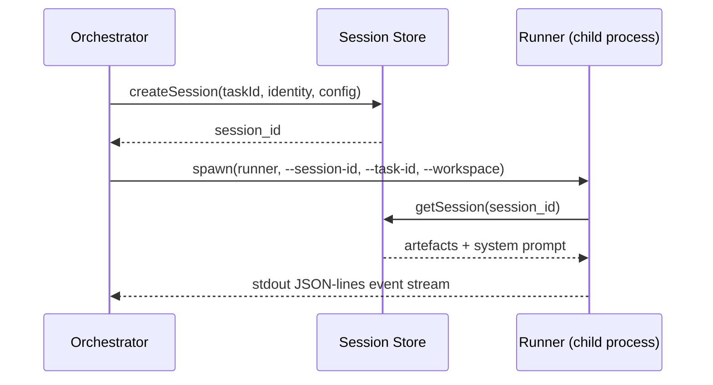
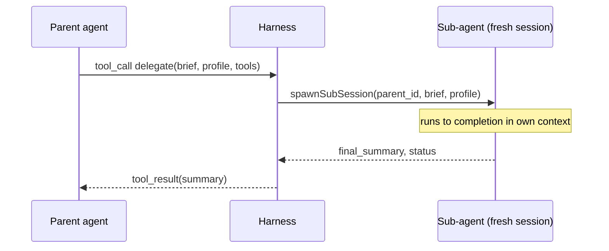
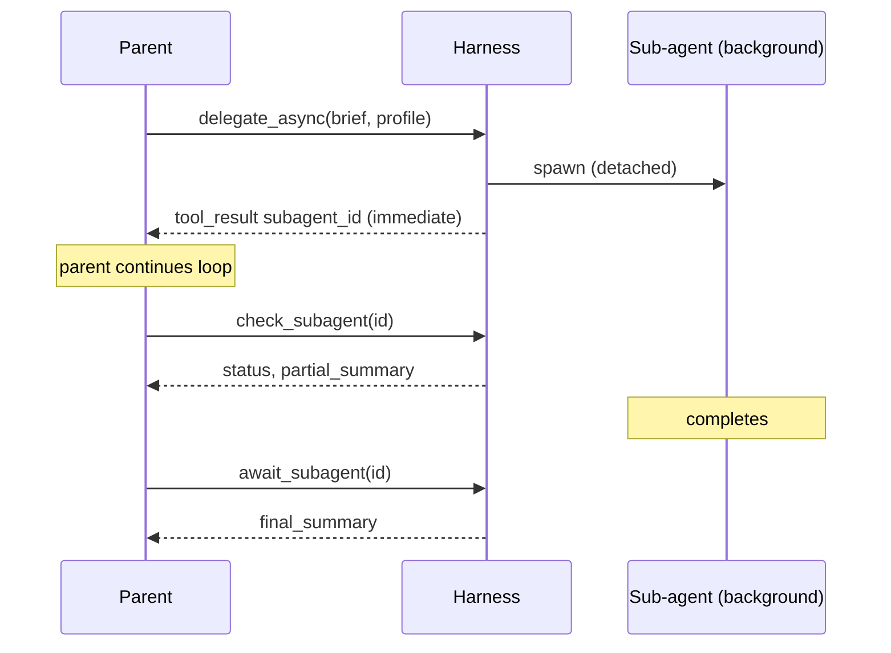
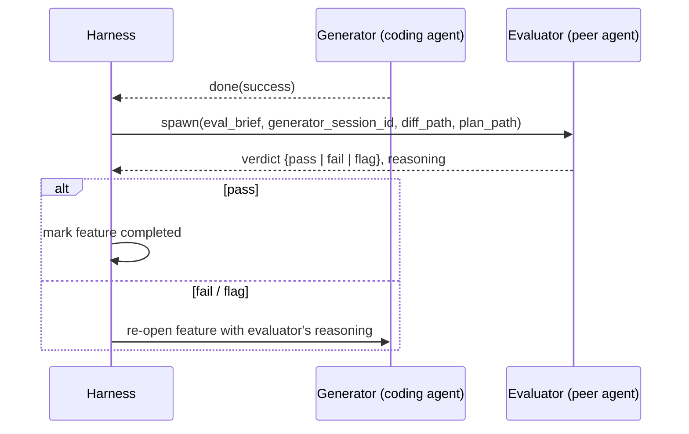

# Agent Harness Blueprint

> **Status.** Vendor-neutral reference. Prescriptive sibling to
> [`agent-harness-analysis.md`](agent-harness-analysis.md). Read this
> if you are *designing* or *implementing* a harness; read the analysis
> if you are *evaluating* one.

---

## Table of contents

| § | Section |
|---|---|
| I | [Executive Summary](#i-executive-summary) |
| II | [Definition (prescriptive)](#ii-definition) |
| III | [Architectural Reference Model](#iii-architectural-reference-model) |
| IV | [Component × Maturity Matrix](#iv-component--maturity-matrix) |
| V | [Concrete Artefact Specifications](#v-concrete-artefact-specifications) |
| VI | [Inter-Component Contracts](#vi-inter-component-contracts) |
| VII | [Capability Maturity Ladder](#vii-capability-maturity-ladder) |
| VIII | [Hello, Agent Harness](#viii-hello-agent-harness) |
| IX | [Anti-Patterns Appendix](#ix-anti-patterns-appendix) |
| X | [Synthesised References](#x-synthesised-references) |
| XI | [Applying the Blueprint](#xi-applying-the-blueprint) |

---

## I. Executive Summary

> *What this section does NOT cover: implementation, evaluation of any specific harness, vendor history.*

An **agent harness** is the engineered scaffolding around an LLM that
turns a stateless next-token predictor into a system that can do work
in the world. The LLM is the smallest part. The harness is everything
else: prompt assembly, the tool layer, the planning loop, the memory
store, permission checks, verification gates, observability plumbing,
and orchestration that schedules and survives failure.

This document synthesises the contemporary canonical pattern from
2025-2026 vendor engineering and research output: Harrison Chase
([NVIDIA AI Podcast](https://www.youtube.com/watch?v=c-fsL0gsmo0)),
Anthropic's seven harness-engineering posts (managed agents,
long-running harnesses, harness design, scientific computing, parallel
Claudes, context engineering, memory tool), OpenAI's harness work
(harness engineering, Symphony, Shell + Skills + Compaction, the
25-hour Codex run), Martin Fowler, LangChain's "Anatomy of an Agent
Harness" and "Deep Agents", MongoDB, Google ADK, and the
[awesome-harness-engineering](https://github.com/ai-boost/awesome-harness-engineering)
taxonomy. References are listed in §X with a one-line synthesis note
per source.

**Three top-level invariants** the rest of this document expands:

1. **Chase's five-primitive fingerprint.** A deep-agent harness is
   *loop + tools + filesystem + planning + sub-agents*. Every other
   primitive is built on top of these five.
2. **Anthropic's four-way decoupling.** **Brain** (inference) +
   **Harness** (loop) + **Hands** (sandbox) + **Session** (state),
   with the harness *stateless* and the session *externalised*.
3. **OpenAI's durable project memory.** Long runs are held together by
   a small set of named, file-format-specified artefacts on disk —
   not by what the model remembers in context.

**Audience.** Engineers designing or implementing agent harnesses.
Anyone evaluating an existing harness should also read
[`agent-harness-analysis.md`](agent-harness-analysis.md), which audits
a specific harness (LocalForge) against this blueprint.

---

## II. Definition

> *What this section does NOT cover: implementation choices, runtime
> selection, evaluation of any specific harness.*

### II.1 The five-primitive fingerprint

After watching Claude Code, Manus, Deep Research, and OpenClaw all
converge on the same shape, Harrison Chase formalised the **deep
agent**: an LLM with autonomy inside an environment. The architectural
fingerprint:

> "An LLM in a tool-calling loop, connected to a file system, using
> planning and sub-agents." — Harrison Chase

Five primitives. Loop, tools, file system, planning, sub-agents. A
harness without all five is a workflow, not a deep agent.

### II.2 The Model + Harness + Environment trinity

```
Deep Agent  =  Model           +  Harness                 +  Environment
              [frontier/open/   [loop, planner, tools,    [filesystem, shell,
               fine-tuned LLM]   sub-agents, memory,       browser, APIs, secure
                                 eval integration]         runtime, GPU/cloud/local]
```

This blueprint specifies the *Harness* column. The other two columns
are configuration choices made when deploying the harness.

### II.3 The twelve components, stated as requirements

The blueprint uses MUST/SHOULD/MAY in the [RFC 2119](https://datatracker.ietf.org/doc/html/rfc2119)
sense.

**MUST — table-stakes for any 2026 harness:**

| # | Component | Requirement |
|---|---|---|
| M1 | **Agent loop** | A harness MUST implement a Thought → Action → Observation cycle that runs until the model emits a final assistant message with no further tool calls, or until a stopping condition (turn cap, watchdog) fires. |
| M2 | **Tool layer** | A harness MUST expose tools as schema-validated callable interfaces with structured outputs. Tool registration, argument validation, sandboxed execution, and result formatting are the harness's responsibility, not the model's. |
| M3 | **File system access** | A harness MUST give the agent read/write/edit access to a workspace directory and treat that directory as both the work product (code/files under construction) AND a substrate the agent can use to externalise state. |
| M4 | **Permissions** | A harness MUST evaluate every tool call against a policy *before* execution. The minimum policy is workspace containment: writes outside the workspace are blocked. |
| M5 | **Observability** | A harness MUST log every tool call, model call, and state transition durably (replayable after restart) AND surface live events for the active session. Both layers are required. |
| M6 | **Workspace isolation** | A harness MUST give each task its own working directory. Concurrent tasks MUST NOT share a write target. |
| M7 | **Verification** | A harness MUST gate task completion on evidence, not on the agent's own claim of success. The minimum evidence is a deterministic check (build, test, lint, smoke) that the harness runs after the agent stops. |

**SHOULD — required for any harness running tasks longer than ~30 minutes:**

| # | Component | Requirement |
|---|---|---|
| S1 | **Planning artefact** | A harness SHOULD persist a goal decomposition as an editable on-disk artefact, not as in-memory state. The artefact SHOULD be human-readable, agent-readable, and editable mid-run. |
| S2 | **Sub-agents** | A harness SHOULD expose synchronous delegation as a first-class tool: the parent agent calls `delegate(brief, tools)`, a fresh agent runs to completion, the parent gets a summary back. |
| S3 | **Skills library** | A harness SHOULD expose reusable capability bundles to the agent. Each bundle is a Markdown manifest plus scripts; the agent sees only the manifest until it invokes the skill. |
| S4 | **Memory substrate** | A harness SHOULD provide persistent, agent-writable state outside the conversation context, surfaced into the system prompt on each session start. |
| S5 | **Compaction** | A harness SHOULD compact the conversation continuously as it grows, not as an emergency response when the context window fills. |

**MAY — frontier capabilities not yet table-stakes:**

| # | Component | Requirement |
|---|---|---|
| Y1 | **Async sub-agents** | A harness MAY expose fire-and-monitor delegation: parent gets a handle immediately and polls or awaits later. |
| Y2 | **Event-driven triggers** | A harness MAY listen for external events (mailboxes, webhooks, file watchers, queues) and dispatch agent runs in response. |
| Y3 | **Per-agent identity** | A harness MAY assign each agent its own credentials, audit trail, and revocation primitive separate from any human user. |
| Y4 | **Generator-Evaluator pair** | A harness MAY pair every coding agent with a peer evaluator agent that has a different system prompt and renders an independent verdict. |

### II.4 Cross-cutting properties

Two properties are not components but invariants the harness must hold
across every component:

- **Durability.** A harness MUST survive process restart with no
  manual reconciliation: feature status, session state, log history,
  and (for SHOULD-tier and above) in-flight conversation state all
  persist.
- **Self-evolution capacity.** A SHOULD-tier harness SHOULD provide
  the *substrate* for self-improvement: an agent-writable memory
  file, a failure-feedback loop, and a skill-library write path. The
  blueprint does not mandate that the agent actually self-improves —
  only that the harness does not prevent it.

---

## III. Architectural Reference Model

> *What this section does NOT cover: file formats (§V); contracts (§VI);
> maturity levels (§VII).*

### III.1 The four-way decoupling

[Anthropic's Managed Agents architecture](https://www.anthropic.com/engineering/managed-agents)
formalises a separation that every mature harness enforces, even when
it doesn't name the layers:



ASCII fallback:

```
       ┌──────────────────────────────────────────────────┐
       │  Stateless harness (cattle, not pets)            │
       │  ┌──────────────┐         ┌───────────────────┐  │
User → │  │   Brain      │ ←─────→ │  Harness (loop +  │  │
       │  │   (LLM)      │         │  planner +        │  │
       │  └──────────────┘         │  tool dispatch)   │  │
       │                           └─────────┬─────────┘  │
       └─────────────────────────────────────│────────────┘
                                             │ execute(name, input)
                                             ▼
                                      ┌─────────────┐
                                      │  Hands      │
                                      │  (sandbox)  │
                                      └──┬────┬─────┘
                                         │    │
                                  ┌──────┘    └──────┐
                                  ▼                  ▼
                         ┌───────────────┐   ┌───────────────┐
                         │  Workspace    │   │  External:    │
                         │  files /      │   │  shell /      │
                         │  artefacts    │   │  browser/APIs │
                         └───────────────┘   └───────────────┘
                                         ▲
                                         │ getSession(id), writeEvent(…)
                                         │
                                  ┌─────────────┐
                                  │  Session    │
                                  │  (durable   │
                                  │  state)     │
                                  └─────────────┘
```

**Brain.** The LLM inference call. Stateless w.r.t. the harness. The
brain doesn't know what container is running; the container doesn't
know which brain is calling.

**Harness.** The loop that drives the brain through Thought → Action
→ Observation, the planner that maintains the goal decomposition, and
the tool dispatcher that routes calls to Hands. **The harness is
stateless.** Every piece of in-flight state lives in Session.

**Hands.** Sandboxed execution. Each sandbox exposes a single
`execute(name, input) → string` interface. The harness sees a tool;
the sandbox sees a function call. Workspace isolation lives here.

**Session.** Externalised, durable state: conversation history, tool-
call event log, planning artefacts, decision log. Sessions resume via
`getSession(id)`. Failed harness containers are *cattle* — replaced,
not debugged.

### III.2 Mapping the twelve components onto the layers

| Layer | Components owned |
|---|---|
| **Brain** | M1 (loop, partial — the brain emits the next move; the harness drives it) |
| **Harness** | M2 (tool dispatch), M4 (permissions pre-check), M5 (observability), M7 (verification gate), S1 (planning), S2 (sub-agent dispatch), S5 (compaction) |
| **Hands** | M3 (file system access), M6 (workspace isolation), Y2 (event sources) |
| **Session** | All durable state: tool-call log, planning artefacts, S4 (memory substrate), S3 (skills library, read by harness from session-scoped storage), Y3 (identity record) |

### III.3 The stateless-harness invariant

A harness implementation MUST be able to:

1. Lose its process at any moment.
2. Have a fresh harness process bind to the same `session_id`.
3. Resume work without the agent re-doing any tool call whose output
   was already recorded.

If the implementation cannot do all three, it has not separated
Harness from Session. The cure is to externalise every piece of
in-flight state to Session before the next tool call begins.

---

## IV. Component × Maturity Matrix

> *What this section does NOT cover: per-vendor scoring (that's the
> audit doc's job); detailed implementation walkthroughs.*

This single table replaces both a "component reference" and an
"evaluation rubric" — they walk the same twelve components and would
drift if separated. Use the **T0 / T3 / T6** columns as a self-check:
a harness that meets every T0 cell is a working MVP; a harness that
meets every T3 cell is production-grade; a harness that meets every
T6 cell is at the frontier of what has shipped publicly.

| # | Component | Failure mode prevented | Reference impls | T0 (MVP) | T3 (mature) | T6 (frontier) | Artefact |
|---|---|---|---|---|---|---|---|
| **M1** | Agent loop | Stateless prompt-API behaviour | Pi, Claude Agent SDK, OpenAI Agents SDK | While-loop until done | Tool-call log durable; retry on transient | Async dispatch + parent monitor | §V.9 |
| **M2** | Tool layer | Hallucinated tool calls | OpenAI tools API, MCP, Pi `defineTool` | 5–7 fs/shell tools, schema-validated | Per-session toolset profiles; risk annotations | MCP-pluggable + per-tool deny lists | §V.6 |
| **M3** | File system access | Black-box agent state | Pi `read/write/edit/bash/grep`, Claude Code | Read/write/edit + bash | Workspace guard + memory substrate | Auto-Dream consolidation | §V.5, §V.1–4 |
| **M4** | Permissions | Unintended destruction | Workspace guard (LocalForge), Claude Code permission system | Path containment | Per-tool allow/deny + risk gates | Per-identity scoped credentials | (contract §VI.4) |
| **M5** | Observability | Undebuggable agents | LangSmith, agent_logs, OTEL | Stdout JSON lines persisted | Durable + live + replay | OTEL traces, per-identity audit | §V.9 |
| **M6** | Workspace isolation | Cross-project contamination | Docker, project folders, git worktrees | Per-project folder | Git worktree per task | Shared bare repo + lockfiles (parallel) | §V.4, §V.8 |
| **M7** | Verification | Self-evaluation bias | Anthropic Generator-Evaluator, Playwright | Build/lint/type after agent stops | E2E tests + Generator-Evaluator pair | Eval suite + Ralph Loop + test oracle | §V.7, §V.8 |
| **S1** | Planning artefact | Plan-then-pray | OpenAI four-file pattern, awesome-harness `Plan.md` | Backlog list with deps | Sprint contracts + on-disk Plan.md | Mid-run replanning + goal hierarchy | §V.2 |
| **S2** | Sub-agents | Context bloat | Claude Code Task tool, LangGraph supervisor | None (single agent) | `delegate(brief)` sync primitive | Async manager+workers + specialisation roles | (contract §VI.3, §VI.4) |
| **S3** | Skills library | Prompt sprawl | OpenAI `SKILL.md`, Claude Skills | None | Markdown manifest + scripts (T0 of skills) | Auto-evolved skills + cross-project skill transfer | §V.6 |
| **S4** | Memory substrate | Sessions start cold | Anthropic memory tool, OpenAI four-file durable memory | None | Four-file durable memory + CHANGELOG with failed approaches | Auto-Dream + cross-project memory | §V.1–5 |
| **S5** | Compaction | Context exhaustion | OpenAI `/responses/compact`, Claude context-engineering | None | Continuous compaction + periodic context resets | Compaction + memory + reset triadic loop | (no artefact) |
| **Y1** | Async sub-agents | Synchronous blocking | (not yet shipped publicly at scale) | N/A | N/A | Fire-and-monitor + manager UI | (contract §VI.4) |
| **Y2** | Event triggers | Click-driven only | (early Anthropic / OpenAI work; Chase prediction) | N/A | N/A | Inbox + webhook + watcher dispatch | §V.7 |
| **Y3** | Per-agent identity | Cross-agent credential leakage | Anthropic Managed Agents creds split, OpenClaw identity | Process-as-user | Per-agent identity record + audit | Scoped credentials + revocation primitive | (no artefact, config) |
| **Y4** | Generator-Evaluator | Self-evaluation bias | Anthropic harness-design post | None | Generator + peer evaluator | Multi-evaluator panel | (contract §VI.5) |

**How to read this matrix.** Each row is one of the requirements in
§II. The "Artefact" column points to §V where the file format is
specified. The "Reference impls" column points to public reference
systems where the pattern is known to work — the harness designer can
verify these claims independently. The T0/T3/T6 columns are
incremental: T3 includes T0; T6 includes T3.

---

## V. Concrete Artefact Specifications

> *What this section does NOT cover: full JSON Schema, field-level
> validation rules, transport encoding. Each spec is "header + 4–6
> required sections + example fragment + one anti-pattern".*

A blueprint without file formats is ungrounded advice. The nine
artefacts below recur across every long-running harness in the
references. Each is described as an **abstract role** first, with the
vendor-specific instance named afterwards as one realisation.

### V.1 Frozen-spec artefact (e.g. `Prompt.md`)

**Role.** The single immutable description of what the harness is
trying to build, surfaced into every session.

**Required sections:**
- `# Goal` — one paragraph.
- `## Hard constraints` — non-negotiables (port, target platforms, dependencies the agent MUST NOT add).
- `## Deliverables` — the artefacts a successful run produces.
- `## Completion criteria` — testable definition of done.
- `## Out of scope` — explicit non-goals.

**Example fragment:**

```markdown
# Goal
Build a CLI that ingests CSV files and emits Parquet, single-binary, no daemons.

## Hard constraints
- Rust 2021. No nightly features.
- Zero network access at runtime.
- Memory ceiling: 200MB for a 10GB input.
```

**Anti-pattern.** The agent edits this file. If the agent can change
the spec, it can declare itself done by deleting the criteria. Make
this file read-only at the tool layer.

**Vendor instance.** OpenAI's [`Prompt.md`](https://developers.openai.com/blog/run-long-horizon-tasks-with-codex)
in the four-file durable-memory pattern.

### V.2 Milestone-plan artefact (e.g. `Plan.md`)

**Role.** The mutable, ordered decomposition of the goal into
verifiable milestones.

**Required sections:**
- `# Plan`
- For each milestone: `## M<n>: <title>`, `### Acceptance criteria`
  (bulleted, testable), `### Validation commands` (shell commands the
  harness can run to check criteria).
- `## Status` — current milestone, paused/blocked notes.

**Example fragment:**

```markdown
## M3: CSV parser handles RFC 4180 edge cases
### Acceptance criteria
- Quoted fields with embedded commas parse correctly
- CRLF and LF line endings both accepted
- Empty trailing fields preserved
### Validation commands
- `cargo test --test csv_parser`
- `bin/csv2parquet tests/fixtures/edge_cases.csv > /dev/null`
```

**Anti-pattern.** Acceptance criteria phrased as goals, not tests. "The parser is robust" is not testable; "all tests in `csv_parser.rs` pass" is.

**Vendor instance.** OpenAI `Plan.md`; awesome-harness milestone artefacts.

### V.3 Execution-discipline artefact (e.g. `Implement.md`)

**Role.** The standing rules of engagement the agent reads at session
start. Not the spec, not the plan — the *how-to-work*.

**Required sections:**
- `# How to work in this repo`
- `## Validation cadence` (when to run tests, lint, type-check).
- `## Scope discipline` (what the agent must not touch).
- `## Failure protocol` (what to do when a validation command fails — fix, don't widen scope).
- `## Hand-off rules` (what state must be left for the next session).

**Anti-pattern.** Including project-specific build steps here. Those
go in `init.sh`. This file is the *workflow*, not the recipe.

**Vendor instance.** OpenAI `Implement.md`.

### V.4 Decision-log / running-notebook artefact (e.g. `Documentation.md`)

**Role.** The agent's running narrative. Status, decisions made and
why, audit trail. Append-only by convention.

**Required sections:**
- `# Run log`
- For each significant action: `## YYYY-MM-DD HH:MM — <action>`,
  `### Why`, `### What changed`, `### Open questions`.

**Example fragment:**

```markdown
## 2026-05-07 11:42 — switched CSV reader from custom to `csv` crate
### Why
RFC 4180 quoting was failing on tests/fixtures/quoted.csv. Building a
correct parser would take more sessions than the build budget allows.
### What changed
Removed src/csv_parse.rs; added `csv = "1.3"` dep; refactored caller.
### Open questions
- Does `csv` crate handle 100MB files in <1s? Need to benchmark M5.
```

**Anti-pattern.** The agent rewrites earlier entries. This file is
append-only. The harness should prefer an `append` tool over `write`
for this path.

**Vendor instance.** OpenAI `Documentation.md`.

### V.5 Failure-log artefact (e.g. `CHANGELOG.md`)

**Role.** Distinct from the decision log: this captures **what was
tried and *why it didn't work***, so successive sessions don't
re-attempt the same dead ends.

**Required sections:**
- `# Status` — one-paragraph current state.
- `## Completed` — bulleted list, each with a session-id reference.
- `## Failed approaches` — for each: what was tried, why it failed,
  what to try next (or "do not retry").
- `## Known limitations` — accepted trade-offs.

**Example fragment:**

```markdown
## Failed approaches
- 2026-05-04: Tried implementing CSV quoting with a hand-rolled
  state machine. Failed because RFC 4180 allows escaped CR inside
  quoted fields and the state machine treated CR as a record terminator.
  Do not retry without first reading sections 2.5–2.7 of the RFC.
```

**Anti-pattern.** Treating this as a TODO list. Failed approaches are
not future work — they're shoals already mapped.

**Vendor instance.** Anthropic's `CHANGELOG.md` from
[Long-running Claude for scientific computing](https://www.anthropic.com/research/long-running-Claude).

### V.6 Capability manifest (e.g. `SKILL.md`)

**Role.** A reusable, named, versioned procedure the agent can invoke.
Not a prompt — a Markdown manifest plus supporting scripts/templates.

**Required sections:**

```markdown
---
name: <slug>
version: <semver>
description: <one paragraph routing logic — see below>
required_tools: [<tool names>]
---

## Use when
- <bulleted situations where this skill applies>

## Don't use when
- <bulleted situations where it must not be used>

## Inputs
- <named inputs the skill expects>

## Procedure
1. <step>
2. <step>

## Outputs
- <what the skill produces>

## Example invocation
<example>
```

**Critical.** The `description` field is **routing logic, not
marketing**. It MUST include negative examples and edge cases. Glean
saw skill triggering drop 20% in production until they added these.

**Anti-pattern.** A skill whose `description` reads like a feature
list. Any phrase a marketing copywriter would write is wrong here.

**Vendor instance.** OpenAI `SKILL.md` from
[Shell + Skills + Compaction](https://developers.openai.com/blog/skills-shell-tips);
Anthropic Skills.

### V.7 Feature-list / task-queue artefact (e.g. `features.json`)

**Role.** A structured list of work items, each with a passes-bool, so
the harness can drive a kanban or queue without parsing prose.

**Schema (informal):**

```json
{
  "features": [
    {
      "id": "f-0042",
      "title": "...",
      "description": "...",
      "category": "functional|style",
      "depends_on": ["f-0040"],
      "validation": "<shell command or list>",
      "passes": false,
      "priority": 100
    }
  ]
}
```

**Critical.** JSON, not Markdown. Per Anthropic, the model is less
likely to corrupt structured data. The schema MUST forbid removing or
re-ordering test entries — usually by making the validation command a
required field that the harness re-runs after every passes flip.

**Anti-pattern.** Allowing the agent to set `passes: true` without the
harness independently re-running the validation. Trust the validation
output, not the agent's claim.

**Vendor instance.** Anthropic's claude.ai-clone feature list from
[Effective harnesses for long-running agents](https://www.anthropic.com/engineering/effective-harnesses-for-long-running-agents).

### V.8 Session-checkpoint artefact

**Role.** The serialised conversation + tool-call state of an in-flight
session, sufficient to resume on a fresh harness process.

**Required fields:**
- `session_id`
- `created_at`, `last_updated_at`
- `system_prompt_hash` (so we know if it changed)
- `messages: [{ role, content, tool_calls }]`
- `tool_call_log_path` (link to §V.9)
- `planning_artefact_paths: { Prompt, Plan, Implement, Documentation, CHANGELOG }`
- `status: in_progress | paused | completed | failed`

**Storage.** A directory per session: `data/sessions/<id>/`. A single
JSON file at the root, plus the artefacts as files alongside.

**Anti-pattern.** Storing this in process memory and writing only on
graceful shutdown. The whole point is to survive ungraceful shutdown.
Write on every `message_end` event.

**Vendor instance.** Pi's `SessionManager` interface (with the `inMemory()`
variant being explicitly *not* what this artefact requires);
Anthropic Managed Agents `getSession(id)`.

### V.9 Tool-call event log artefact

**Role.** Every tool call and its result, durably recorded, so a
restarted session can replay completed calls as cached results.

**Schema (one event per row in append-only file or table):**

```jsonl
{"ts": "...", "session": "...", "turn": 7, "tool": "read",
 "args": {"path": "src/lib.rs"}, "result_hash": "sha256:...",
 "result_inline_or_path": "...", "ok": true, "duration_ms": 23}
```

**Critical.** Two requirements:
1. **Idempotency keys.** Every event has a deterministic key
   (`session_id × turn × tool × args_hash`) so replays are stable.
2. **Result storage.** Small results inline, large results spilled to
   a content-addressed store (`results/<sha256>.bin`) and referenced
   by hash.

**Anti-pattern.** Logging summaries instead of raw results. The replay
mechanism needs the actual bytes the agent saw.

**Vendor instance.** Anthropic Managed Agents session log; LangSmith trace events.

---

## VI. Inter-Component Contracts

> *What this section does NOT cover: wire-level transport (HTTP vs IPC
> vs queue); auth (handled at §V.8 session and Y3 identity).*

Five contracts hold a deep-agent harness together. Each is given as
**Mermaid sequence diagram + ASCII fallback + payload table**.

### VI.1 Orchestrator → Runner

**Trigger.** A new task is ready to start (user click, event,
auto-continue).



ASCII fallback:

```
Orchestrator ─ createSession(…) ─→ Session Store
                                       │
Orchestrator ←── session_id ───────────┘
       │
       └── spawn(runner, …) ──→ Runner ── getSession(id) ──→ Session Store
                                  │                              │
                                  ←──── artefacts + prompt ──────┘
                                  │
       Orchestrator ←─ JSON-lines event stream ─── Runner
```

**Payload — `spawn` arguments:**

| Field | Type | Notes |
|---|---|---|
| `session_id` | string | Foreign key into Session Store. |
| `task_id` | string | Resolves to a feature/work item. |
| `workspace_path` | absolute path | Cwd for the runner; agent's allowed write root. |
| `identity_id` | string | Whose credentials this run uses (Y3). |
| `model_config` | `{provider, baseUrl, model}` | Brain configuration. |
| `harness_config` | `{max_turns, watchdog_ms, retry_policy}` | Loop parameters. |

**Failure semantics.** Runner crash before first event → orchestrator
reaps the session row, returns task to backlog. Runner exit non-zero
→ `failed` status; idempotent re-run is allowed because tool-call log
is durable.

**Idempotency.** `(session_id × spawn_attempt)` is unique. Re-spawning
the same `session_id` resumes from the last logged event.

### VI.2 Runner → Brain (model)

**Trigger.** Each turn of the agent loop.

```mermaid
sequenceDiagram
    participant R as Runner
    participant B as Brain (LLM provider)
    participant T as Tool dispatcher
    R->>B: chatCompletion(messages, tools, …)
    B-->>R: assistant_message (with tool_calls?)
    alt has tool_calls
        R->>T: execute(name, input)
        T-->>R: tool_result
        R->>R: append to messages, log event
    else final
        R->>R: emit done(success)
    end
```



ASCII fallback:

```
Runner ── chatCompletion(messages, tools) ──→ Brain
Runner ←──────── assistant_message ──────────  Brain
   │
   ├── if assistant_message.tool_calls:
   │      Runner ── execute(name, input) ──→ Tool dispatcher
   │      Runner ←──── tool_result ─────────  Tool dispatcher
   │      Runner: append to messages, log event
   │      loop next turn
   │
   └── else (no tool_calls):
          Runner: emit done(success)
```

**Payload — `chatCompletion` request:**

| Field | Type | Notes |
|---|---|---|
| `messages` | array | Compaction-aware view; older turns may be summarised. |
| `tools` | array of schemas | Filtered per session profile. |
| `temperature`, `max_tokens` | numbers | Provider-specific. |
| `stop` | array | Optional. |

**Failure semantics.** Provider 5xx / `ECONNRESET` / "failed to
generate valid tool call" → harness retries up to N times with
backoff. Hard failure → write `failed` to session log, abort.

**Idempotency.** A retry MUST produce the same effects as the first
attempt: tool calls logged with idempotency keys are de-duped.

### VI.3 Parent → Sub-agent (synchronous delegate)

**Trigger.** Parent's loop emits a `delegate` tool call.



ASCII fallback:

```
Parent agent ── delegate(brief, profile) ──→ Harness
                                                │
                                                └── spawn fresh sub-session ──→ Sub-agent
                                                                                  │ (full loop)
                                                                                  ▼
                                              Parent ←── summary ←── Harness ←── Sub-agent
```

**Payload — `delegate(...)`:**

| Field | Notes |
|---|---|
| `brief` | One-paragraph task description. |
| `profile` | Named sub-agent profile: `code-reviewer`, `test-writer`, `researcher`, `planner`. Each profile pre-configures system prompt + allowed tools. |
| `inputs` | Optional: file paths, diff text, queries. Bounded — no sharing of full parent context. |
| `max_turns` | Independent budget. |

**Critical property.** The sub-agent's tool calls and tokens are
**absorbed**. Only the final summary returns to the parent. This is
the context-bloat protection.

**Failure semantics.** Sub-agent exhausts budget → returns `partial`
with what it has; parent decides whether to retry, accept, or escalate.

**Idempotency.** Sub-sessions have their own `session_id` and full
durable session record. The parent's tool-result row records the
sub-session's id — replays are stable.

### VI.4 Parent → Sub-agent (asynchronous)

**Trigger.** Parent emits `delegate_async`; continues working.



ASCII fallback:

```
Parent ── delegate_async(brief, profile) ──→ Harness
                                                │
                                                └── spawn detached ──→ Sub-agent
                                                                          │ (background)
Parent ←── subagent_id (immediate) ────────  Harness                     │
   │                                                                      │
   │ (parent continues its own loop)                                      │
   │                                                                      │
Parent ── check_subagent(id) ────────────→ Harness                       │
Parent ←── {status, progress_summary} ──── Harness                       │
                                                                          ▼
                                                              (sub-agent completes)
   │                                                                      │
Parent ── await_subagent(id, timeout?) ──→ Harness ←── final_summary ────┘
Parent ←── final_summary ─────────────── Harness
```

**Payload — additions over §VI.3:**

| Field | Notes |
|---|---|
| Returned: `subagent_id` | Handle for later polling. |
| `check_subagent(id)` | Returns `{status, progress_summary}`. |
| `await_subagent(id, timeout)` | Blocks (or returns timeout) until done. |

**Failure semantics.** Sub-session crash → status flips to `failed`,
parent's next `check` surfaces it; parent decides recovery. The
parent's loop must be resilient to a sub-agent that never completes.

### VI.5 Evaluator → Generator

**Trigger.** A coding-agent session emits `done(success)`. The
harness, not the agent, dispatches the evaluator.



ASCII fallback:

```
Generator ── done(success) ──→ Harness
                                  │
                                  └── spawn evaluator with:
                                       - eval_brief
                                       - generator_session_id
                                       - diff_path
                                       - plan_path
                                       │
                                       ▼
                                   Evaluator ── verdict + reasoning ──→ Harness
                                                                          │
                              ┌─────── if pass ─────────┘
                              │           Harness: mark feature completed
                              │
                              └─── if fail / flag ──→ Harness re-opens feature for
                                                       Generator with the
                                                       evaluator's reasoning attached
```

**Payload — evaluator inputs:**

| Field | Notes |
|---|---|
| `feature_spec` | The relevant `Plan.md` milestone. |
| `diff` | Generator's git diff. |
| `documentation_log_excerpt` | Generator's run-log entries from this session. |
| `validation_outputs` | Stdout of the validation commands the harness ran. |

**Critical.** The evaluator MUST have a different system prompt from
the generator and MUST NOT have write access. This is the pre-condition
for the verdict being independent.

**Failure semantics.** Evaluator timeout → fall back to "pass" only if
deterministic validation also passed; otherwise `flag` for human
review.

---

## VII. Capability Maturity Ladder

> *What this section does NOT cover: cost or hardware estimates;
> per-vendor pricing.*

Seven tiers, T0–T6. Each builds strictly on the previous. The "exit
criteria" column tells you when to stop polishing the current tier
and start on the next.

### Tier 0 — MVP: a working single-agent loop

**Must-haves:** M1 (loop), M2 (5–7 fs/shell tools), M3 (workspace
read/write), M4 (path containment), M5 (stdout JSON-lines persisted),
M6 (per-task folder), M7 (basic build/lint/type after agent stops).

**Anti-patterns:** No tool schemas (raw text parsing); model writes
arbitrary paths; logs only to stdout; "done" = "agent said done".

**Exit criteria:** A single task runs end-to-end, produces a working
artefact, fails cleanly when validation fails, and leaves a durable
log of what happened.

**Real-system citation:** LocalForge today (see analysis doc).

### Tier 1 — Durable sessions

**Adds:** §V.8 session checkpoint, §V.9 tool-call event log, replay-
on-restart, in-flight conversation persisted after every turn.

**Anti-patterns:** `SessionManager.inMemory()`; in-process state;
"reconcile orphaned sessions on next start" as the only recovery.

**Exit criteria:** Killing the harness mid-task and starting a fresh
process resumes the agent at the last completed turn with no manual
reconciliation.

**Real-system citation:** Anthropic Managed Agents `getSession(id)`.

### Tier 2 — Writable agent memory

**Adds:** §V.1 frozen spec, §V.2 plan, §V.3 execution discipline,
§V.4 decision log, §V.5 failure log. Every coding session reads these
in; the agent has tools to append to log + decision artefacts.

**Anti-patterns:** A single mega-`AGENT_NOTES.md` (untyped); agents
that can edit the frozen spec; failure log treated as TODO list.

**Exit criteria:** The same task run twice produces measurably better
behaviour the second time, because the failure log was read in.

**Real-system citation:** OpenAI four-file durable memory pattern;
Anthropic `CHANGELOG.md`.

### Tier 3 — Verification depth and Generator-Evaluator

**Adds:** Real test suite invocation; type-check gate; lint gate; a
small (5–10 scenario) eval suite run on CI; Y4 Generator-Evaluator
pair on every coding session.

**Anti-patterns:** Verification = "page has a title"; eval = "we'll
do it later"; agent claims success counted as success.

**Exit criteria:** A regressing prompt change is caught by the eval
suite *before* it reaches a user, with a deterministic failure message.

**Real-system citation:** Anthropic harness-design Generator-Evaluator;
LangSmith eval suites.

### Tier 4 — Sub-agents and skills

**Adds:** S2 synchronous `delegate(brief, profile)`; S3 `SKILL.md`
manifest format with use-when/don't-use-when descriptions; specialised
sub-agent profiles (`code-reviewer`, `test-writer`, `researcher`,
`planner`).

**Anti-patterns:** One generalist agent doing everything; skills as
prompts (no scripts, no manifest); skill descriptions written as
marketing copy.

**Exit criteria:** A long task spawns sub-agents whose tool outputs do
not bloat the parent context, and the parent's final-context length is
within 20% of what it was at task start.

**Real-system citation:** Claude Code Task tool; OpenAI `SKILL.md`;
LangGraph supervisor.

### Tier 5 — Self-evolving multi-agent fleet

**Adds:** Compaction continuous; periodic context resets; parallel
agents on shared bare git repo with lockfiles (the Anthropic C-compiler
topology); brain/harness/hands/session 4-way decoupling fully
realised; MCP integration; per-tool permissions with risk annotations.

**Anti-patterns:** Compaction triggered only at context-window limit;
parallel agents racing on the same working directory; harness as
stateful (cattle-vs-pets failure).

**Exit criteria:** A 16-agent run completes a 100k-LOC task with
durable progress and conflict resolution, no human babysitting needed.

**Real-system citation:** Anthropic [Building a C compiler with
parallel Claudes](https://www.anthropic.com/engineering/building-c-compiler);
Anthropic [Managed Agents](https://www.anthropic.com/engineering/managed-agents).

### Tier 6 — Frontier (not yet shipped publicly at scale)

**Adds:** Y1 async sub-agents (manager UI: user talks to orchestrator,
not coder); Y2 always-on event-driven triggers (mailbox, webhook,
queue, file watcher); Y3 per-agent identity + scoped credentials +
audit trail + revocation; Auto-Dream / cross-session memory
consolidation.

**Anti-patterns:** "Always-on" implemented as a polling loop with no
cost class; agent uses the user's credentials by default; identity = a
boolean flag; Auto-Dream that mutates the frozen spec.

**Exit criteria (not yet observed in any shipped system):** An agent
runs continuously for >30 days, handles >100 events, learns from
each, has its own audit trail, can be revoked atomically, and
demonstrates measurable improvement over its initial behaviour.

**Real-system citation:** Open. Chase's stated near-term roadmap
(NVIDIA AI Podcast). OpenClaw is the closest public proof-of-concept.

---

## VIII. Hello, Agent Harness

> *What this section does NOT cover: production hardening, real SDKs,
> error handling beyond the bare minimum.*

The minimum harness that exhibits every MUST from §II, in ~50 lines of
Python-flavoured pseudocode. Inline comments map each line to its
§II requirement.

```python
import json, subprocess, hashlib, pathlib

# === M3: workspace ===
WORKSPACE = pathlib.Path("/tmp/hello-harness/work")
SESSIONS  = pathlib.Path("/tmp/hello-harness/sessions")

# === M2: tool layer ===
TOOLS = {
    "read":  {"params": ["path"]},
    "write": {"params": ["path", "content"]},
    "shell": {"params": ["cmd"]},
}

def execute(name, args, session_id, turn):
    # === M4: permissions (path containment) ===
    if name in ("read", "write"):
        target = (WORKSPACE / args["path"]).resolve()
        if not str(target).startswith(str(WORKSPACE.resolve())):
            return {"ok": False, "error": "path outside workspace"}
    # === M3: file system access ===
    if name == "read":  result = target.read_text()
    elif name == "write": target.write_text(args["content"]); result = "ok"
    elif name == "shell":
        # also subject to M4 in production: scan for paths
        result = subprocess.run(args["cmd"], shell=True, cwd=WORKSPACE,
                                capture_output=True, text=True).stdout
    # === M5: observability (durable log) ===
    event = {"session": session_id, "turn": turn, "tool": name,
             "args": args, "result_hash": hashlib.sha256(result.encode()).hexdigest(),
             "result": result[:1000], "ok": True}
    (SESSIONS / session_id / "tool_calls.jsonl").open("a").write(json.dumps(event)+"\n")
    return {"ok": True, "result": result}

def llm_call(messages, tools):
    # Stand-in for a real provider call.
    ...

# === M1: agent loop ===
def run(session_id, system_prompt, user_goal, max_turns=20):
    (SESSIONS / session_id).mkdir(parents=True, exist_ok=True)
    # === M6: workspace isolation (per-session subdir would go here) ===
    messages = [{"role": "system", "content": system_prompt},
                {"role": "user",   "content": user_goal}]
    for turn in range(max_turns):
        reply = llm_call(messages, list(TOOLS.keys()))
        messages.append(reply)
        if not reply.get("tool_calls"):
            break  # final assistant message → done
        for call in reply["tool_calls"]:
            obs = execute(call["name"], call["args"], session_id, turn)
            messages.append({"role": "tool", "name": call["name"],
                             "content": json.dumps(obs)})

    # === M7: verification gate (the harness, NOT the agent, decides done) ===
    check = subprocess.run(["bash", "-lc", "make test"], cwd=WORKSPACE,
                           capture_output=True, text=True)
    return {"ok": check.returncode == 0, "stdout": check.stdout}

if __name__ == "__main__":
    print(run("s-001",
              system_prompt="You are a coding agent. Use read/write/shell.",
              user_goal="Implement fizzbuzz in src/fizzbuzz.py and ensure `make test` passes."))
```

**Coverage check.** This 50-line skeleton exhibits all seven MUSTs.
What it does **not** have: any SHOULD or MAY component. Adding S1
(planning) means writing `Plan.md` to disk and surfacing it in the
system prompt; adding S2 (sub-agents) means adding a `delegate` tool
that recurses into `run`; adding S4 (memory) means surfacing
`Documentation.md` from the previous session. Each is a small,
self-contained extension of the same skeleton. That extensibility is
the test.

---

## IX. Anti-Patterns Appendix

> *What this section does NOT cover: vendor naming or shaming. These
> are pattern-level failure modes any team can fall into.*

### IX.1 Compaction-only memory

**Trigger.** "We don't need a memory file — we'll just summarise the
conversation when context gets full."

**Why it fails.** Compaction loses the *unstructured* parts that
matter most: failed approaches, decisions, gotchas. Successive sessions
see only "we did X" and re-attempt the same dead ends.

**Fix.** Compaction is necessary but not sufficient. Pair it with
§V.4 decision log and §V.5 failure log. (S5 + S4 together, not S5
alone.)

### IX.2 Supervisor-as-bottleneck

**Trigger.** "We have a single orchestrator that decides everything."

**Why it fails.** The orchestrator becomes the slowest, most
context-bloated agent in the system. Sub-agents wait. Throughput
collapses.

**Fix.** Sub-agents are autonomous (§VI.3, §VI.4). The orchestrator
issues briefs and integrates results; it does not micromanage. For
parallel work, prefer the [Anthropic C-compiler topology](https://www.anthropic.com/engineering/building-c-compiler):
shared bare git repo + lockfiles, no central coordinator.

### IX.3 Tool sprawl

**Trigger.** "Let's add another tool. And another. And one for
this special case."

**Why it fails.** The model spends more tokens on tool selection than
on the task. Routing accuracy drops; spurious tool calls multiply.

**Fix.** Per-session toolset profiles (M2 at T3). The bootstrapper
and the coder do not need the same tools. Audit toolsets quarterly;
cut anything called <1% of runs.

### IX.4 Eval-as-afterthought

**Trigger.** "We'll add evals once we have enough users."

**Why it fails.** Without evals, regressions caused by prompt or
harness changes are invisible. By the time users complain, the
regression is weeks old and entangled with other changes.

**Fix.** Start with 5–10 eval scenarios. Run on every change. Per
Chase: "the act of writing eval cases is itself product design
because it forces you to define what the agent should and should not do."

### IX.5 In-memory session state

**Trigger.** "We'll persist on graceful shutdown."

**Why it fails.** Ungraceful shutdowns are the common case. Process
crashes, OOM kills, deploys, host reboots. Anything not written to
durable storage *before* the next tool call begins is lost.

**Fix.** Write the session-checkpoint artefact (§V.8) on every
`message_end` event, atomically (write-temp + rename). Tier 1 in the
maturity ladder; everything else builds on it.

### IX.6 Generalist sub-agents

**Trigger.** "We'll just spawn another instance of the main agent for
sub-tasks."

**Why it fails.** A generalist sub-agent has no context advantage over
the parent. Context gets duplicated, not absorbed. Specialised system
prompts are the *point*.

**Fix.** Define a small set of named profiles: `code-reviewer` (read-
only, gets a diff), `test-writer` (writes only to `tests/`),
`researcher` (read + grep + bash, no write), `planner` (read +
edit-plan-only). The parent picks the profile in the `delegate` call
(§VI.3).

---

## X. Synthesised References

> *What this section does NOT cover: exhaustive bibliography. These
> are the sources whose patterns this blueprint encodes; one line per
> source explains what it contributed.*

### Loop & Compaction

- [Building Effective AI Agents — Anthropic](https://www.anthropic.com/research/building-effective-agents) — Defined "agents are LLMs autonomously using tools in a loop"; the M1 baseline.
- [Effective context engineering for AI agents — Anthropic](https://www.anthropic.com/engineering/effective-context-engineering-for-ai-agents) — Source for compaction + structured note-taking + multi-agent triadic loop.
- [Shell + Skills + Compaction — OpenAI](https://developers.openai.com/blog/skills-shell-tips) — Compaction-as-default rule (S5).

### Skills & Tools

- [Writing effective tools for AI agents — Anthropic](https://www.anthropic.com/engineering/writing-tools-for-agents) — Tool design discipline; informs §V.6 anti-pattern about marketing-style descriptions.
- [Shell + Skills + Compaction — OpenAI](https://developers.openai.com/blog/skills-shell-tips) — `SKILL.md` manifest format with use-when/don't-use-when (V.6); Glean 73→85% accuracy data.
- [Model Context Protocol](https://modelcontextprotocol.io/) — Tool registration / pluggability standard for T5.

### Sub-agents & Parallelism

- [Create custom subagents — Claude Code Docs](https://code.claude.com/docs/en/sub-agents) — `delegate` primitive; up to 7 parallel; specialised profiles (VI.3).
- [Subagents in the SDK — Claude API](https://platform.claude.com/docs/en/agent-sdk/subagents) — SDK-level sub-agent contract.
- [LangGraph Supervisor](https://github.com/langchain-ai/langgraph-supervisor-py) — Hierarchical delegation reference for VI.3.
- [Where to use sub-agents vs agents-as-tools — Google Cloud](https://cloud.google.com/blog/topics/developers-practitioners/where-to-use-sub-agents-versus-agents-as-tools/) — Distinction encoded in §II.S2.
- [Building a C compiler with parallel Claudes — Anthropic](https://www.anthropic.com/engineering/building-c-compiler) — Tier 5 parallel topology (shared bare git + lockfiles).

### Memory & Sessions

- [Memory tool — Claude API Docs](https://platform.claude.com/docs/en/agents-and-tools/tool-use/memory-tool) — File-based persistent memory (S4).
- [Effective harnesses for long-running agents — Anthropic](https://www.anthropic.com/engineering/effective-harnesses-for-long-running-agents) — Initializer agent + feature-list-as-JSON + mergeable invariant.
- [Long-running Claude for scientific computing — Anthropic](https://www.anthropic.com/research/long-running-Claude) — `CHANGELOG.md` with failed-approaches (V.5); Ralph Loop; test-oracle.
- [Run long horizon tasks with Codex — OpenAI](https://developers.openai.com/blog/run-long-horizon-tasks-with-codex) — The four-file durable-memory pattern (V.1–V.4); 25h / 30k LOC benchmark.
- [Scaling Managed Agents — Anthropic](https://www.anthropic.com/engineering/managed-agents) — Brain/Harness/Hands/Session 4-way split (§III); §V.8 session checkpoint contract.

### Verification

- [Harness design for long-running app development — Anthropic](https://www.anthropic.com/engineering/harness-design-long-running-apps) — Generator-Evaluator pattern (Y4); sprint contracts; "use model gains to simplify the harness".
- [Harrison Chase on the NVIDIA AI Podcast](https://www.youtube.com/watch?v=c-fsL0gsmo0) — "5–10 eval scenarios is enough to start"; eval-as-product-design.

### Observability

- [LangSmith](https://www.langchain.com/langsmith) — Trace + eval reference for M5 at T3.
- [The Anatomy of an Agent Harness — LangChain](https://www.langchain.com/blog/the-anatomy-of-an-agent-harness) — Four-component framing reused in §II / §IV.

### Multi-agent Topologies

- [Developer's guide to multi-agent patterns in ADK — Google](https://developers.googleblog.com/developers-guide-to-multi-agent-patterns-in-adk/) — Hierarchical agent tree; informs Tier 4/5 transitions.
- [An open-source spec for Codex orchestration: Symphony — OpenAI](https://openai.com/index/open-source-codex-orchestration-symphony/) — Issue-tracker-driven orchestration for Tier 5+.
- [Harness engineering: leveraging Codex — OpenAI](https://openai.com/index/harness-engineering/) — The "harness, not model" thesis the entire blueprint rests on.

### Cross-cutting

- [The Agent Harness: Why the LLM Is the Smallest Part — MongoDB](https://www.mongodb.com/company/blog/technical/agent-harness-why-llm-is-smallest-part-of-your-agent-system) — Original framing.
- [Harness engineering for coding agent users — Martin Fowler](https://martinfowler.com/articles/harness-engineering.html) — Guides-vs-sensors; computational-vs-inferential controls.
- [What Is an Agent Harness? — Firecrawl](https://www.firecrawl.dev/blog/what-is-an-agent-harness) — 4-component popular-press taxonomy.
- [awesome-harness-engineering — GitHub](https://github.com/ai-boost/awesome-harness-engineering) — Source of the 12-component taxonomy in §II.3.

---

## XI. Applying the Blueprint

> *What this section does NOT cover: a tutorial; production deployment guidance.*

To **assess an existing harness**, walk it down §IV (component matrix)
and assign T0/T3/T6 verdicts per row. The header line of each row is
the requirement; the cells tell you what it looks like at each
maturity level. Score honestly. Aggregate.

For a worked example, see
[`agent-harness-analysis.md`](agent-harness-analysis.md), which
applies this blueprint to the LocalForge harness in this repo. That
analysis also references
[`pi-integration.md`](../concepts/pi-integration.md) for the concrete
Brain/Harness split between the Pi SDK and the LocalForge harness.

To **build a new harness**, work bottom-up through §VII (the maturity
ladder). Do not skip Tier 1 — durable sessions are the prerequisite
for everything above them. Do not gold-plate Tier 0 — the sooner you
have a working end-to-end skeleton, the sooner the eval suite tells
you what's actually broken.

The §VIII Hello-Harness is a good seed for a new project. Every line
of it is annotated with the §II requirement it satisfies; the
extension path to Tier 3 is straightforward and is described in the
"adds" line of each tier in §VII.

---

*End of blueprint.*
