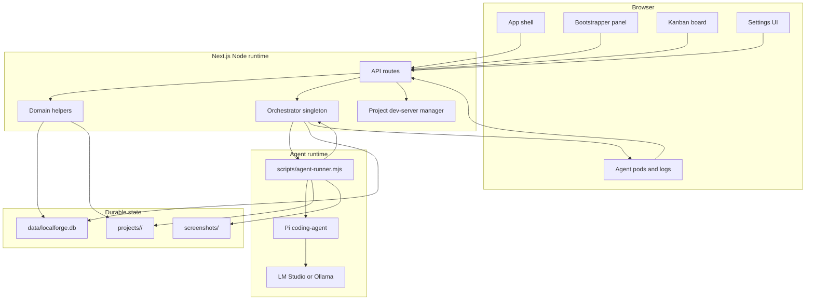

# System design

LocalForge is a single Next.js application that stores durable control-plane state in SQLite and delegates long-running coding work to child processes.

## Component diagram

## Component breakdown

| Component | Responsibility | Representative files |
|-----------|----------------|----------------------|
| Next.js pages and components | Render project shell, bootstrapper, kanban, settings, agent slots, completion screens | `app/`, `components/` |
| API routes | Parse HTTP requests, call domain/orchestration services, stream SSE | `app/api/**/route.ts` |
| Domain helpers | Encapsulate DB operations and validation outside of route handlers | `lib/projects.ts`, `lib/features.ts`, `lib/settings.ts`, `lib/agent-sessions.ts` |
| Database layer | Own SQLite connection, migrations, and schema | `lib/db/index.ts`, `lib/db/schema.ts`, `drizzle/` |
| Provider layer | Describe and probe LM Studio/Ollama endpoints | `lib/agent/providers/` |
| Orchestrator | Schedule coding sessions and manage child processes | `lib/agent/orchestrator.ts` |
| Agent runner | Execute one Pi coding-agent session and optional browser verification | `scripts/agent-runner.mjs` |
| Dev-server manager | Start and stop generated project dev servers | `lib/dev-server.ts` |

## Data flow: create a project

1. UI submits project name and optional description.
2. API route calls `createProject()`.
3. `createProject()` validates the name, chooses a unique folder, writes `.pi/models.json`, inserts the project row, and rolls back the folder if insertion fails.
4. Sidebar reads `listProjectsWithProgress()` to show project progress.

## Data flow: generate features from chat

1. Bootstrapper chat messages are stored in `chat_messages`.
2. The feature-generation route loads the transcript.
3. It creates a Pi session with built-in tools disabled.
4. The Pi session calls LocalForge custom feature tools.
5. The tools call the same validated feature helpers the REST API uses.
6. The route closes the bootstrapper session only after at least one feature was created.

## Data flow: run a coding feature

1. Project page calls `POST /api/projects/:id/orchestrator`.
2. Orchestrator finds a ready feature and moves it to `in_progress`.
3. Orchestrator inserts a coding session row.
4. Orchestrator spawns the runner and passes provider/model/project/feature context.
5. Runner drives Pi coding-agent inside the project folder.
6. Runner writes JSON-line logs to stdout.
7. Orchestrator stores logs in `agent_logs` and broadcasts SSE events.
8. Runner emits `done`.
9. Orchestrator finalizes session and feature status.

## Data flow: stream activity

Two layers make logs robust:

| Layer | Purpose |
|-------|---------|
| SQLite `agent_logs` | Replay history after refresh or reconnect |
| In-memory EventEmitter | Push live updates with low latency |

`GET /api/agent/stream/:sessionId` first replays stored logs, then subscribes to live session events. `GET /api/agent/events` listens globally for all sessions and project-completion events.

## Key design decisions

### Use SQLite for control-plane durability

SQLite keeps LocalForge easy to run locally while preserving state across server restarts. The database stores control-plane facts: projects, features, dependencies, sessions, logs, chat, and settings.

Trade-off: this is not designed for multiple concurrent server instances writing to the same database.

### Keep long-running work out of request handlers

The orchestrator starts `scripts/agent-runner.mjs` as a child process. This lets coding sessions outlive the immediate HTTP request and gives the server a process handle for stop/cleanup behavior.

Trade-off: child-process state is runtime state, so a full server restart can leave orphan session rows that must be reconciled.

### Treat project folders as the write boundary

The runner's system prompt and workspace guard both enforce that coding agents modify only the generated project directory.

Trade-off: generated apps must be self-contained enough for an agent to build and test without editing the LocalForge harness.

### Use project overrides over global settings

Global settings provide defaults. Project settings let one project use a different provider, model, prompt, dev server port, concurrency, or Playwright mode.

Trade-off: debugging a run requires checking the effective settings, not only the global settings page.

## Scaling characteristics

| Area | Current behavior | Limit |
|------|------------------|-------|
| Agent concurrency | Per-project cap clamped to 1-3 | Local CPU/GPU/model server capacity is the real bottleneck |
| Event streaming | SSE per browser connection | EventEmitter listener cap is raised for dev, but this is still local-first |
| Database | File-backed SQLite with WAL | Not a distributed multi-writer database |
| Generated projects | Separate folders under working directory | Disk usage grows with generated apps and screenshots |
| Provider calls | One local provider endpoint per effective settings | Provider must handle concurrent sessions |

## External dependencies

| Dependency | Purpose |
|------------|---------|
| `@mariozechner/pi-coding-agent` | Agent sessions, model registry, tools, resource loading |
| `better-sqlite3` and `drizzle-orm` | Local persistent database |
| `@playwright/test` | Optional post-run browser verification |
| LM Studio or Ollama | Local model serving |
| Next.js | UI and API runtime |
