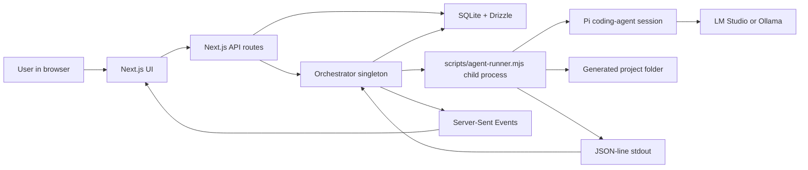

# What is LocalForge?

LocalForge is a local web app that coordinates local LLM coding agents to build user-defined software projects feature by feature.

## The problem it solves

LocalForge gives a local coding model a harness: persistent project state, a backlog, dependency ordering, session logs, process isolation, and optional browser verification. Without that harness, a model can edit files, but it has no durable memory of which feature is next, which run failed, which project folder is safe to touch, or how the UI should recover after a server restart.

The app is designed for local inference providers such as LM Studio and Ollama. The provider must expose an OpenAI-compatible endpoint, but no cloud model key is required by default.

## Mental model

Think of LocalForge as four layers:

| Layer | What it does | Main source |
|-------|--------------|-------------|
| Product UI | Projects, bootstrapper chat, kanban board, agent slots, settings, activity logs | `app/`, `components/` |
| Domain services | Validates and persists projects, features, dependencies, settings, sessions, and logs | `lib/projects.ts`, `lib/features.ts`, `lib/settings.ts`, `lib/agent-sessions.ts` |
| Orchestration | Picks ready work, starts or stops agent sessions, broadcasts live status | `lib/agent/orchestrator.ts` |
| Agent execution | Runs Pi coding-agent in a child process, confines writes to the project folder, streams JSON-line events | `scripts/agent-runner.mjs` |

LocalForge itself is not the app being built. It is the control plane that creates and manages separate app folders under the configured working directory.

## Architecture overview

## How it fits together

1. A user creates a LocalForge project. LocalForge creates a database row, a folder on disk, and a `.pi/models.json` file inside that folder.
2. The user either adds backlog features manually or chats with the bootstrapper.
3. The bootstrapper calls LocalForge feature tools to create a validated backlog with dependencies.
4. The user starts the agent queue. The orchestrator selects the highest-priority backlog feature whose dependencies are completed.
5. The orchestrator creates an `agent_sessions` row, marks the feature `in_progress`, writes a temporary prompt JSON file, and spawns `scripts/agent-runner.mjs`.
6. The runner creates a Pi coding-agent session pointed at the configured local provider. It tells the agent to edit only the generated project folder.
7. The runner emits JSON lines for logs, tool actions, screenshots, test results, and final outcome.
8. The orchestrator stores those events in `agent_logs`, broadcasts them over SSE, and transitions the feature to `completed` or back to `backlog`.
9. When every feature in a project is complete, LocalForge marks the project `completed` and emits a project completion event.

## What LocalForge is not

LocalForge is not a hosted CI system. Agent execution happens on the same machine as the Next.js server.

LocalForge is not a general multi-tenant platform. The SQLite database, generated project folders, local model URLs, and child processes assume a trusted local desktop or workstation.

LocalForge is not a replacement for reviewing code. The runner asks agents to run checks, and optional Playwright verification can add a browser smoke test, but the output still needs human judgment for production use.
